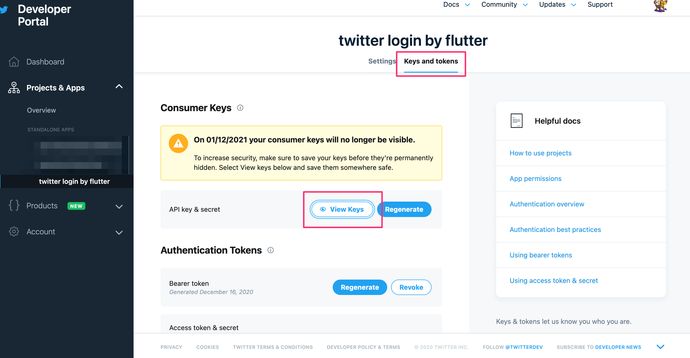
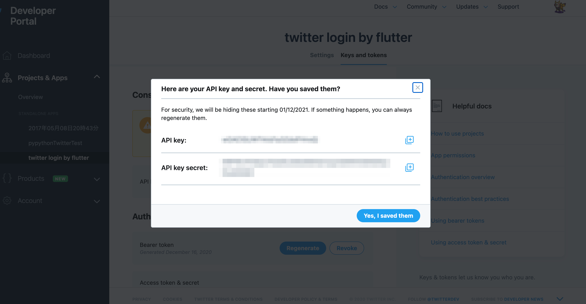

# twitter_login_sample

Flutterでtwitter認証を使ってログインをするサンプルです。

.envにCONSUMER_KEYとCONSUMER_SECRET_KEYを設定してください。

``` .env
#.envファイル
CONSUMER_KEY=123456789abcdf
CONSUMER_SECRET_KEY=12345abcd
```

設定する値はTwitter Developer Portalサイトで作成されたアプリのAPI keyと API secret keyを使用してください。
上記の例は、API keyが123456789abcdf、 API key secretが12345abcdの場合の設定です。

アプリを作成していない方はTwitter Developer Portalサイトにアクセスし、アプリを作成します。
https://developer.twitter.com/en/portal/dashboard
作成後、`Projects & Apps`メニューの`Keys and tokens`タブを選択し、View KeysをクリックするとAPI keyとAPI key secretが表示されるので.envファイルに追加します。





## Getting Started

This project is a starting point for a Flutter application.

A few resources to get you started if this is your first Flutter project:

- [Lab: Write your first Flutter app](https://flutter.dev/docs/get-started/codelab)
- [Cookbook: Useful Flutter samples](https://flutter.dev/docs/cookbook)

For help getting started with Flutter, view our
[online documentation](https://flutter.dev/docs), which offers tutorials,
samples, guidance on mobile development, and a full API reference.
